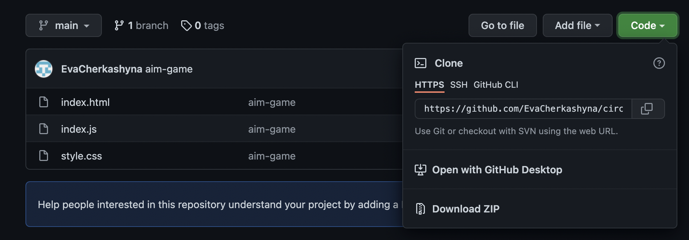

# Board

# Description

This is a __graphic__ __board__ implemented using JS. This mini project can help make larger projects more interesting.

# Objective
The goal of creating this project was to look at various elements and practice in JavaScript.
+ work with ***dynamics***
+ choice of random ___colors___
+ work with different  ___"addEventListener"___ such as "mouseover", "mouseleave"
+ work with ___functions___
+ work with ___arrays___
+ work with ___destructuring___

# How it works

 
You only have to put your fingers on the touchpad and write or draw something on it.

# Live Demo
For the convenience of viewing my project follow instructions:

+ after clicking on the link, increase the game window as shown in the video
+ click the RUN button in the top left corner
enjoy it! [Board](https://jsfiddle.net/EvaCherkashyna/76njmour/)

# Instruction about download

1. Copy the link you can find by clicking on the green button "Сode".
2. In the terminal: git clone link.
3. The project will be copied to the selected folder.

